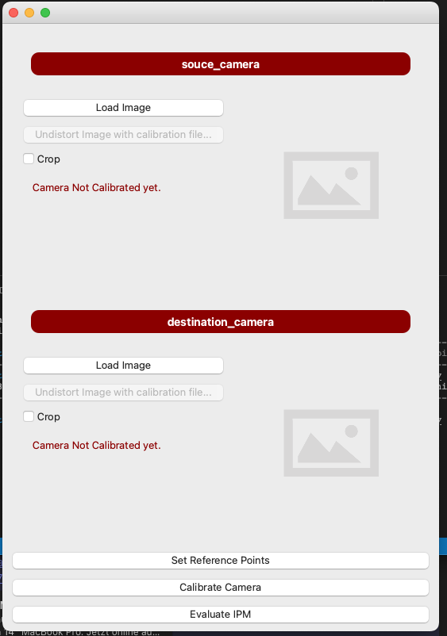
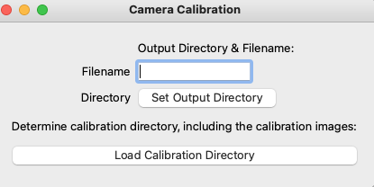
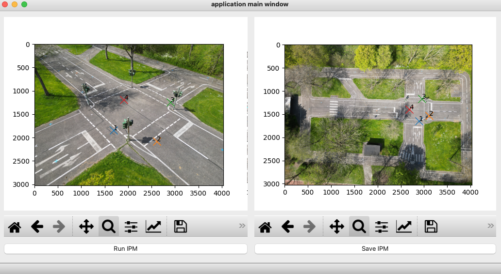
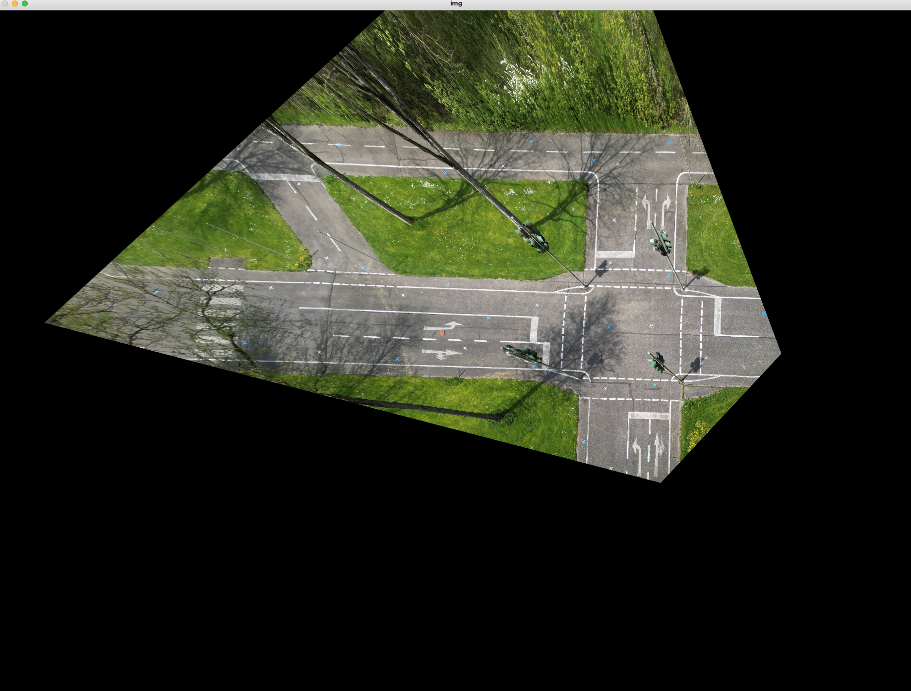

# IPM Tool
Inverse Perspective Mapping: A simple tool to calibrate cameras, set and save reference points, and calculate an homography matrix.

With the tool you can:
- **Undistort images** given a calibration file (crop if wanted)
- **Save calibration Matrix** given a directory of checkerboard images (Zhang)
- **Set and save reference points** with a GUI
- **Calculate and save homography matrix** after setting reference points

## Usage
### 1. Calculate Calibration Matrix
Click on Calibrate Camera:

- Specify output filename and directory
- Determine Directory where the calibration images (checkerboard, Zhang) are located

### 2. Set Reference Points
With click on set reference points you can start setting reference points and calculate the homography matrix:

controls: 
- press `x` to set a point
- press `r` to undo

#### 2.1 Preview Homography
With a click on Run IPM you can test your homography:

#### 2.2 Save Homography
With a click on Save IPM you can save your homography matrix, and the corresponding reference points and images in the outputs/{prompted dir name} folder.
